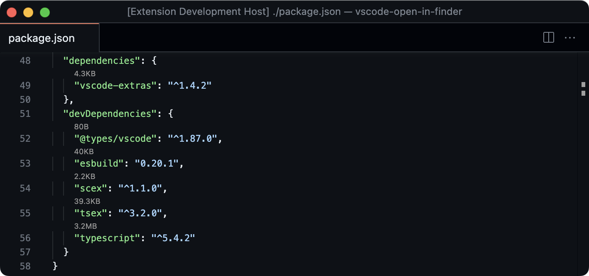
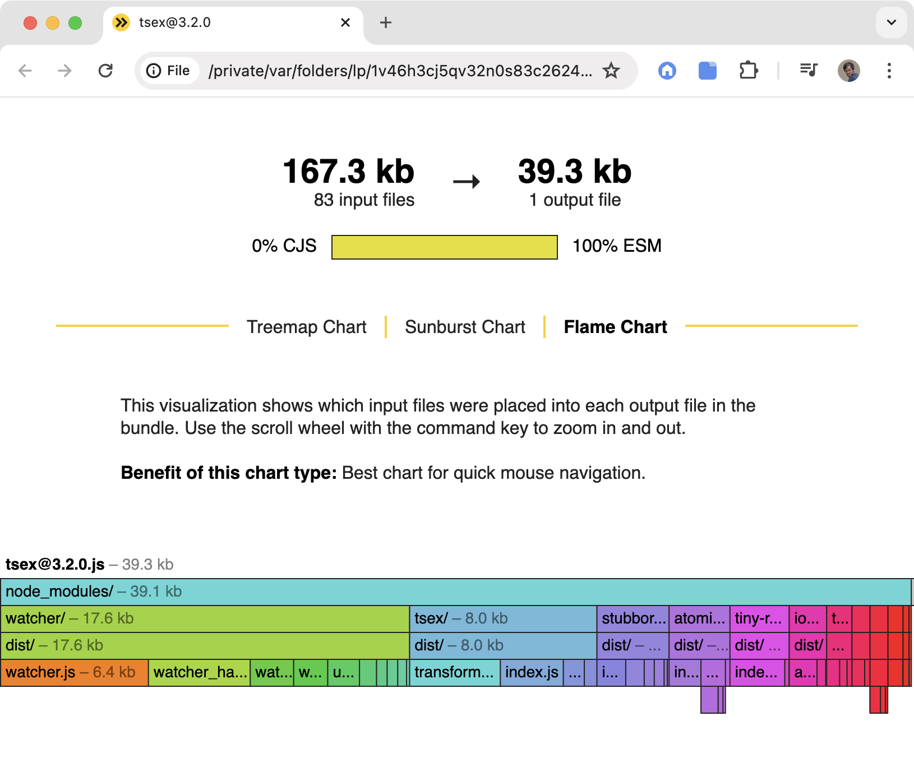

# Banal

<p align="center">
  
</p>

A super quick way to inspect the bundle size of npm dependencies, via a code lens.

Clicking the code lens will instantly open up [`esbuild`](https://github.com/evanw/esbuild)'s bundle analyzer for the currently installed version of the target dependency.

This extension requires [`npm-cli`](https://github.com/npm/cli) and [`banal-cli`](https://github.com/fabiospampinato/banal)>=1.6.0 to be installed and it only works for npm dependencies listead in `package.json` files.

## Install

Follow the instructions in the [Marketplace](https://marketplace.visualstudio.com/items?itemName=fabiospampinato.vscode-banal), or run the following in the command palette:

```sh
ext install fabiospampinato.vscode-banal
```

## Usage

It adds 3 commands to the command palette:

```js
'Banal: Toggle' // Enable or disable the code lens
'Banal: Disable' // Disable the code lens
'Banal: Enable' // Enable the code lens
```

## Settings

```js
{
  "banal.enabled": true // Whether the code lens is enabled or not
}
```

## Demo





## License

MIT © Fabio Spampinato
